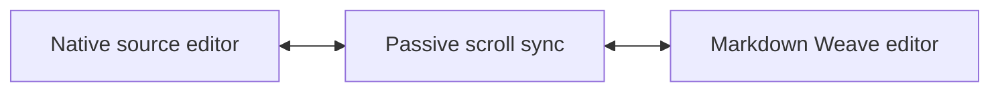

# Side-by-Side Scroll Fixture

This `.markdown` file exists to verify that Markdown Weave handles both supported file extensions: `.md` and `.markdown`.

## Tall Section A

The repeated paragraphs below make scroll synchronization easier to inspect when this file is opened beside its source.

1. Attention mixes information across token positions.
2. Positional encodings preserve order information.
3. Residual connections preserve a stable editing path through the document.

$$
H^{(\ell+1)} = \operatorname{LayerNorm}\left(H^{(\ell)} + \operatorname{MHA}(H^{(\ell)})\right)
$$

## Tall Section B

> Side-by-side mode should keep the native source editor and Markdown Weave view close to the same scroll position without rewriting the source.

## Tall Section C

| Surface | Expected check |
|---|---|
| Native source | Raw Markdown remains canonical |
| Markdown Weave | Rendered preview tracks scroll |
| Breadcrumb | Current heading updates |

Back to [[transformer-attention-fixture]].
