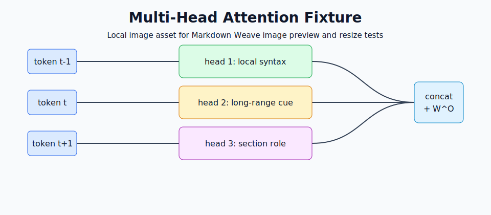
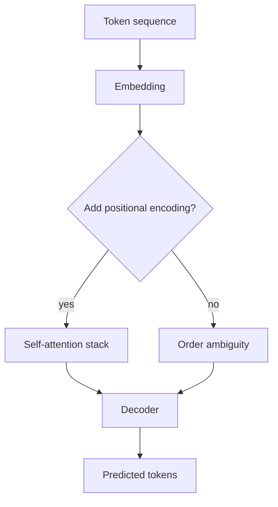
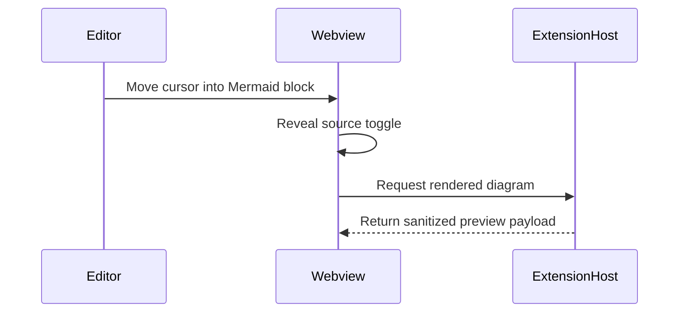
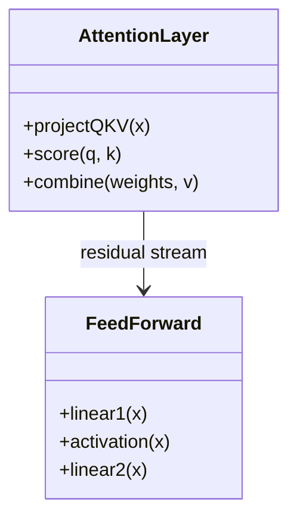
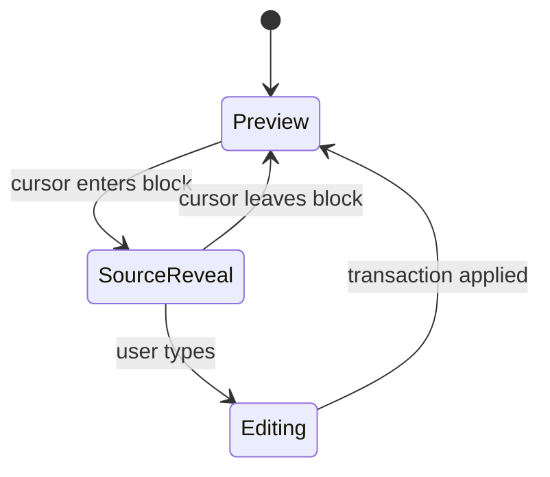
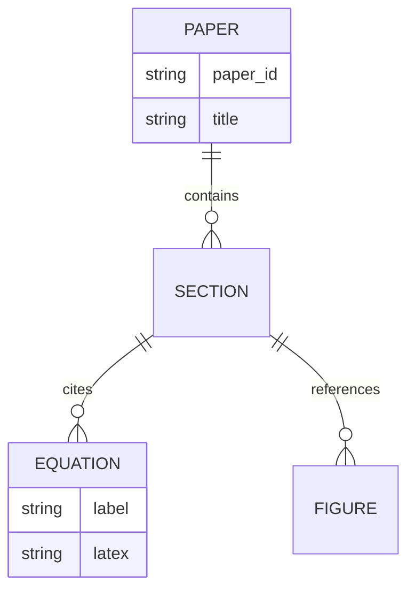
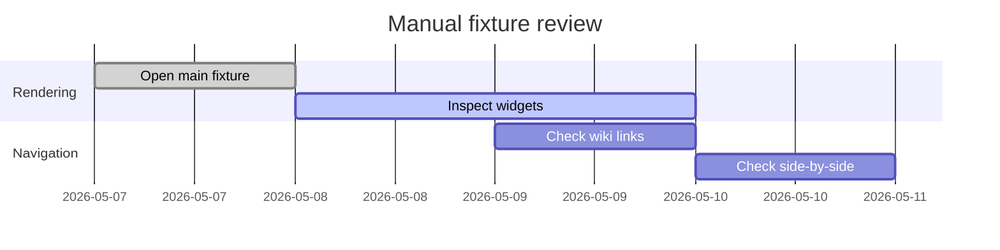
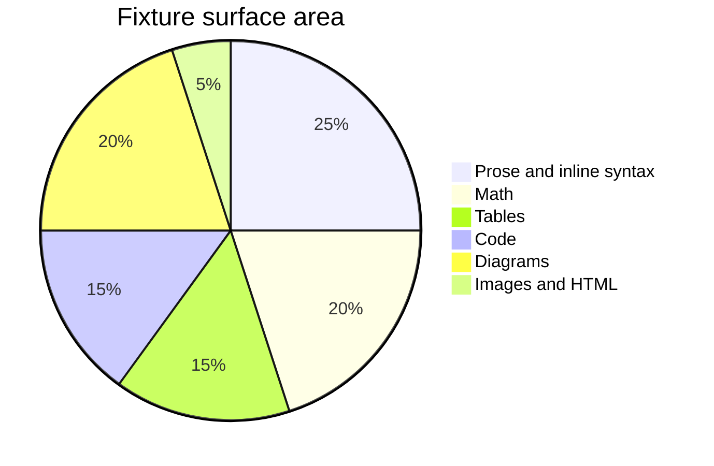

# A Reproducible Markdown Weave Fixture for Transformer Attention

**Abstract.** This document is a realistic academic-style fixture for Markdown Weave. It is inspired by transformer attention papers, especially [Attention Is All You Need](https://arxiv.org/abs/1706.03762), but it is synthetic and written for editor testing rather than as a literature summary. The document intentionally mixes *normal prose*, **strong claims**, ***nested emphasis***, ~~discarded hypotheses~~, `inline code`, links, images, lists, tables, math, Mermaid diagrams, frontmatter, and embedded HTML.

The source file should remain canonical. Editing a rendered block should reveal only the relevant Markdown syntax, and leaving the block should restore the preview.

## Document Map

- Main methods note: [[attention-methods|companion methods]]
- Dataset note: [[dataset-card]]
- `.markdown` extension note: [[side-by-side-scroll]]
- Glossary anchor: [[glossary#Attention score]]
- Broken wiki link fixture: [[missing-transformer-note]]
- External source: [arXiv record](https://arxiv.org/abs/1706.03762)
- Bare URL fixture: https://example.org/markdownweave-fixture

Setext Heading Fixture
======================

This setext heading should appear in the outline and breadcrumb path. The paragraph includes inline math $d_{\text{model}} = 512$, escaped punctuation \*literal asterisks\*, and a reference-style link to the [project README][readme].

[readme]: ../../README.md

## 1. Introduction

Transformers replaced recurrence with attention, making sequence modeling easier to parallelize. In a live-preview editor, the paper format is useful because it naturally combines dense prose, formulas, figures, citations, tables, code, and nested structure.

> The fixture is not trying to benchmark model quality. It is designed to reveal rendering, cursor-boundary, source-toggle, and widget-height problems in a document that feels like something a researcher might actually edit.

The following horizontal rule separates the narrative paper from the first technical section.

---

### 1.1 Claims Under Test

- **Headings:** ATX `#` through `######` and a setext heading.
- **Inline decorations:** bold, italic, strikethrough, inline code, links, images, and wiki links.
- **Block decorations:** blockquotes, horizontal rules, ordered lists, unordered lists, nested lists, and task checkboxes.
- **Widgets:** fenced code blocks, tables, math, Mermaid diagrams, YAML frontmatter, images, and sanitized HTML.
- **Navigation:** outline sidebar, breadcrumb segments, wiki-link targets, broken wiki-link styling, and side-by-side scroll sync.

#### 1.1.1 Nested List Fixture

1. Define an input sequence.
   - Tokenize with a reversible subword vocabulary.
   - Preserve offsets for source highlighting.
     - Store byte offsets.
     - Store display offsets.
2. Build projections.
   1. Compute queries.
   2. Compute keys.
   3. Compute values.
3. Render diagnostics.
   - [x] Inline math renders.
   - [x] Tables render as read-only previews.
   - [x] Mermaid source can be toggled.
   - [ ] Paste-image behavior must be tested manually in the editor.
   - [ ] Side-by-side scroll sync requires a VS Code window.

##### 1.1.1.1 H5 Boundary Test

This heading tests small heading styles and breadcrumb depth.

###### 1.1.1.1.1 H6 Boundary Test

This deepest heading tests outline density and heading-level cycling shortcuts.

## 2. Model Formulation

Let $X \in \mathbb{R}^{n \times d_{\text{model}}}$ be an embedded token sequence. A single attention head projects $X$ into query, key, and value matrices:

$$
Q = XW^Q,\qquad K = XW^K,\qquad V = XW^V
$$

The scaled dot-product attention operator is:

$$
\operatorname{Attention}(Q,K,V)
= \operatorname{softmax}\left(\frac{QK^\top}{\sqrt{d_k}}\right)V
$$

Multi-head attention concatenates independently projected heads:

$$
\operatorname{MultiHead}(Q,K,V)
= \operatorname{Concat}(\operatorname{head}_1,\ldots,\operatorname{head}_h)W^O
$$

where each head is:

$$
\operatorname{head}_i =
\operatorname{Attention}(QW_i^Q, KW_i^K, VW_i^V)
$$

### 2.1 Positional Encoding

The sinusoidal encoding can be expressed with a piecewise definition:

$$
PE_{(pos, i)} =
\begin{cases}
\sin\left(pos / 10000^{i/d_{\text{model}}}\right), & i \text{ even} \\
\cos\left(pos / 10000^{(i-1)/d_{\text{model}}}\right), & i \text{ odd}
\end{cases}
$$

The local Jacobian of a simplified residual block, included to stress matrix rendering, is:

$$
J =
\begin{bmatrix}
\frac{\partial y_1}{\partial x_1} & \frac{\partial y_1}{\partial x_2} & \cdots & \frac{\partial y_1}{\partial x_n} \\
\frac{\partial y_2}{\partial x_1} & \frac{\partial y_2}{\partial x_2} & \cdots & \frac{\partial y_2}{\partial x_n} \\
\vdots & \vdots & \ddots & \vdots \\
\frac{\partial y_n}{\partial x_1} & \frac{\partial y_n}{\partial x_2} & \cdots & \frac{\partial y_n}{\partial x_n}
\end{bmatrix}
$$

### 2.2 Optimization Objective

For a target sequence $y_{1:T}$ and model parameters $\theta$, the negative log-likelihood is:

$$
\mathcal{L}(\theta)
= -\sum_{t=1}^{T}\log p_{\theta}(y_t \mid y_{<t}, x)
+ \lambda \lVert \theta \rVert_2^2
$$

The gradient update used by the synthetic experiment is:

$$
\theta_{k+1}
= \theta_k - \eta_k
\frac{\hat{m}_k}{\sqrt{\hat{v}_k} + \epsilon}
$$

Inline formula density test: if $q_i^\top k_j$ grows with $d_k$, scaling by $\sqrt{d_k}$ keeps the logits in a numerically stable range.

## 3. Figures and Images

The first image is a local SVG asset. It should resolve relative to this file.



The next image uses the legacy Markdown image-size suffix. Markdown Weave should preview the local image and preserve the `=480x210` suffix.


The following image uses safe HTML dimensions, matching Markdown Weave's resize persistence strategy.


The next fixture uses a remote image URL. It may depend on network access in the webview, but the Markdown parser should still treat it as an image node.


Missing-image fallback fixture:


## 4. Tables

Markdown Weave currently renders tables as read-only previews with raw-source toggle behavior. Alignment markers, inline formatting, links, and math should survive in the source.

| Component | Formula or artifact | Expected editor behavior | Status |
|:---|:---:|:---|---:|
| Scaled attention | $\operatorname{softmax}(QK^\top/\sqrt{d_k})V$ | Render as a table cell with inline math | 1 |
| Feed-forward block | `Linear -> GELU -> Linear` | Preserve inline code styling | 2 |
| Dataset note | [[dataset-card]] | Render wiki link and allow Ctrl+Click | 3 |
| External paper | [arXiv](https://arxiv.org/abs/1706.03762) | Render regular link | 4 |

### 4.1 Ablation Results

| Variant | Heads | Layers | Validation loss | BLEU-like score | Comment |
|---|---:|---:|---:|---:|---|
| Baseline recurrent encoder | 1 | 4 | 3.41 | 24.8 | Slower context mixing |
| Single-head attention | 1 | 6 | 2.97 | 27.3 | Useful but brittle |
| Multi-head attention | 8 | 6 | 2.61 | 29.9 | Best synthetic run |
| No positional encoding | 8 | 6 | 3.18 | 25.7 | Fails order-sensitive cases |

## 5. Code Blocks

The code blocks below exercise Shiki highlighting, language labels, long lines, and source-mode toggling.

```python
import math
import numpy as np

def scaled_dot_product_attention(q: np.ndarray, k: np.ndarray, v: np.ndarray) -> np.ndarray:
    logits = q @ k.T / math.sqrt(k.shape[-1])
    weights = np.exp(logits - logits.max(axis=-1, keepdims=True))
    weights = weights / weights.sum(axis=-1, keepdims=True)
    return weights @ v
```

```ts
type AttentionBatch = {
  queries: number[][];
  keys: number[][];
  values: number[][];
  mask?: boolean[][];
};

export function describeBatch(batch: AttentionBatch): string {
  return `q=${batch.queries.length}, k=${batch.keys.length}, v=${batch.values.length}`;
}
```

```json
{
  "experiment": "markdownweave-transformer-fixture",
  "seed": 170603762,
  "implementedFeaturesOnly": true,
  "manualChecks": ["breadcrumb", "outline", "wiki-links", "side-by-side-scroll"]
}
```

```diff
- recurrent_state = gru(token, recurrent_state)
+ context = scaled_dot_product_attention(q, k, v)
+ residual_stream = layer_norm(token + context)
```

```sh
npm run compile
npm run check-types
```

Plain fenced block without a language:

```
Q, K, V -> attention weights -> weighted values -> residual stream
```

## 6. Mermaid Diagrams

Each diagram is intentionally small enough to inspect in the editor but different enough to exercise multiple Mermaid renderers.

### 6.1 Flowchart



### 6.2 Sequence Diagram



### 6.3 Class Diagram



### 6.4 State Diagram



### 6.5 Entity Relationship Diagram



### 6.6 Gantt Diagram



### 6.7 Pie Chart



## 7. Embedded HTML

The HTML block below uses safe elements and attributes. It should render through the sanitizer without executing active content.

<section>
  <h3>HTML Fixture Card</h3>
  <p><strong>Purpose:</strong> verify sanitized embedded HTML rendering, nested inline tags, and safe image dimensions.</p>
  <figure>
    
    <figcaption>Local SVG embedded through an HTML image tag.</figcaption>
  </figure>
</section>

Inline HTML fixture: this sentence includes <mark>marked text</mark>, <kbd>Ctrl</kbd>+<kbd>K</kbd>, <sub>subscript</sub>, and <sup>superscript</sup>.

## 8. Manual Editing Checks

Use this section as a focused checklist after the realistic paper body renders.

- [ ] Click inside the H1 and confirm the leading `#` marker is revealed at the boundary.
- [ ] Click inside **bold text** and confirm only the relevant inline marker is revealed.
- [ ] Click inside *italic text* and confirm the marker reveal does not disturb adjacent words.
- [x] Click inside ~~struck text~~ and confirm strikethrough source markers are editable.
- [ ] Click `inline code` and confirm backticks reveal cleanly.
- [x] Ctrl+Click [the arXiv link](https://arxiv.org/abs/1706.03762).
- [ ] Ctrl+Click [[attention-methods|the companion methods note]].
- [ ] Confirm [[missing-transformer-note]] appears with broken-link styling.
- [ ] Toggle a task checkbox in preview mode.
- [ ] Toggle a table to raw-source mode and back.
- [ ] Toggle a fenced code block to source mode and back.
- [ ] Toggle a Mermaid diagram to source mode and back.
- [ ] Resize an image and verify the persisted source syntax.
- [ ] Open side-by-side mode and check passive scroll synchronization.
- [ ] Ctrl+Click [[side-by-side-scroll]] and confirm `.markdown` files open with Markdown Weave support.
- [ ] Verify the outline sidebar includes the nested H2-H6 structure.
- [ ] Verify breadcrumb sibling dropdowns around `6. Mermaid Diagrams`.

## 9. Individual Feature Gallery

### 9.1 Inline Syntax

Plain text, **bold**, *italic*, ***bold italic***, ~~strikethrough~~, `inline code`, [inline link](https://example.com), [[glossary|wiki alias]], [[glossary#Head]], and .

### 9.2 Blockquote

> Blockquote level one with **bold** text.
>
> > Nested blockquote with inline math $O(n^2d)$.

### 9.3 Lists

- Unordered parent
  - Child item A
  - Child item B with `code`
- Another parent

1. Ordered parent
2. Ordered item with nested tasks
   - [x] Completed nested task
   - [ ] Open nested task

### 9.4 Horizontal Rules

***

---

___

### 9.5 Math Stress Panel

$$
\begin{aligned}
\nabla_\theta \mathcal{L}
&= \nabla_\theta \left[-\sum_{t=1}^{T}\log p_\theta(y_t \mid y_{<t},x)\right] \\
&= -\sum_{t=1}^{T}\frac{1}{p_\theta(y_t \mid y_{<t},x)}
\nabla_\theta p_\theta(y_t \mid y_{<t},x)
\end{aligned}
$$

$$
\Pr(Y=y \mid X=x)
= \prod_{t=1}^{T}
\frac{\exp(z_{t,y_t})}{\sum_{c \in \mathcal{V}}\exp(z_{t,c})}
$$

### 9.6 Table Stress Panel

| Left aligned | Center aligned | Right aligned |
|:---|:---:|---:|
| `code` | **bold** | $x^2$ |
| [link](https://example.com) | [[dataset-card]] | ~~obsolete~~ |
| long text that should wrap without changing the source | image path `./assets/attention-heads.svg` | 12345 |

## References and Attribution

- Vaswani, A. et al. [Attention Is All You Need](https://arxiv.org/abs/1706.03762), arXiv:1706.03762.
- Remote image fixture: [The Transformer model architecture](https://commons.wikimedia.org/wiki/File:The-Transformer-model-architecture.png), Wikimedia Commons, CC BY-SA 3.0.
- Local SVG fixture in `./assets/attention-heads.svg` was created specifically for this Markdown Weave test document.
