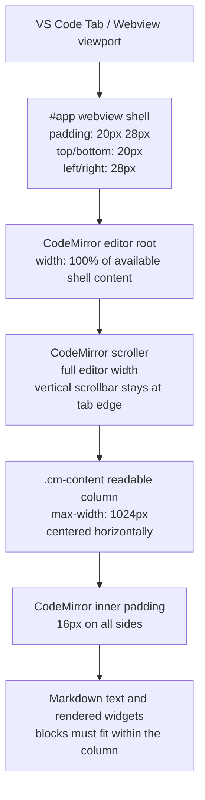

# Webview Layout Reference

This document describes the MarkdownWeave webview shell, CodeMirror editor host, and centered readable content column. It exists as a reference for future layout, theming, and widget work.

## Padding Model

The webview shell uses CSS shorthand:

```css
padding: 20px 28px;
```

That means:

- `20px` top and bottom padding
- `28px` left and right padding

The left and right shell padding values are equal. The centered readable column is inside CodeMirror, not the outer webview shell. The `1024px` maximum applies to `.cm-content`, and includes CodeMirror's own `16px` inner padding.

## ASCII Diagram

```text
VS Code Tab / Webview viewport
+--------------------------------------------------------------+
| #app shell padding                                           |
| top: 20px                                                    |
| left: 28px                                      right: 28px  |
|  +--------------------------------------------------------+  |
|  | CodeMirror editor root: width 100%                     |  |
|  |  +--------------------------------------------------+  |  |
|  |  | CodeMirror scroller: full tab width              |  |  |
|  |  |                                                  |  |  |
|  |  |        centered .cm-content, max 1024px          |  |  |
|  |  |        +--------------------------------+        |  |  |
|  |  |        | inner CM padding: 16px         |        |  |  |
|  |  |        |                                |        |  |  |
|  |  |        | all markdown text/widgets here |        |  |  |
|  |  |        |                                |        |  |  |
|  |  |        |                                |        |  |  |
|  |  |        |                                |        |  |  |
|  |  |        |                                |        |  |  |
|  |  |        |                                |        |  |  |
|  |  |        |                                |        |  |  |
|  |  |        |                                |        |  |  |
|  |  |        +--------------------------------+        |  |  |
|  |  +--------------------------------------------------+  |  |
|  +--------------------------------------------------------+  |
| bottom: 20px                                                 |
+--------------------------------------------------------------+
```

## Mermaid Diagram



## Practical Implications

- The webview shell controls the fixed distance from the VS Code tab edge.
- The CodeMirror editor root and scroller must remain full-width so centering is calculated against the whole tab content area.
- Only `.cm-content` is capped and centered.
- Rendered widgets, revealed raw source, inline math, display math, tables, images, and diagrams should fit inside `.cm-content`.
- Widgets should clamp, wrap, or scale locally instead of creating document-wide horizontal overflow.
