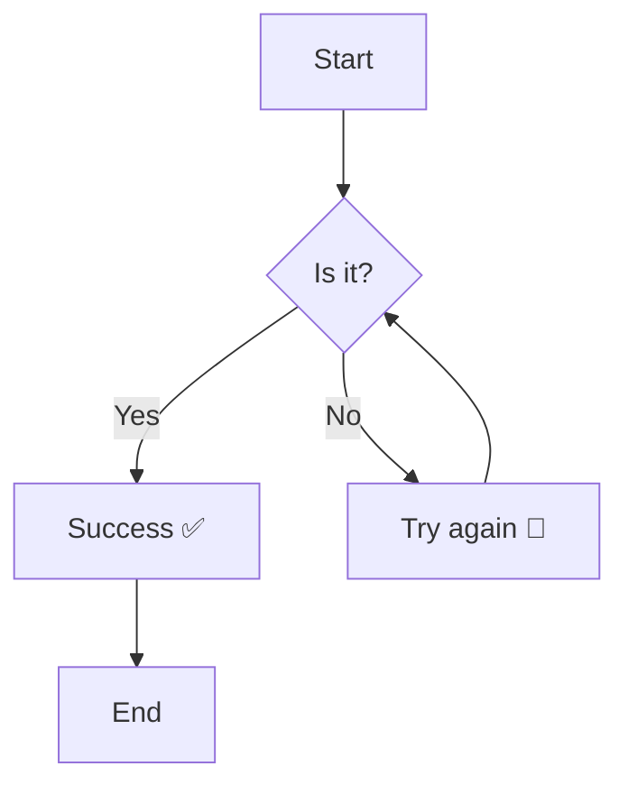

# Phase 03 - Testing Implementation

## Embedded HTML

<kbd>Ctrl+C</kbd>

<mark>TODO:</mark> This is a TODO comment

Sup <sup>2</sup>

Sub <sub>2</sub>

<script>alert(1)</script>
URL with `javascript:` or `on*` attributes are removed: <a href="" javascript:>Test anchor tag</a>

</img>

## Math

$E = mc^2$

$\int_{0}^{\infty} e^{-x^2} \, dx = \frac{\sqrt{\pi}}{2} = \lim_{n \to \infty} \sum_{k=1}^{n} \frac{1}{k^2} \cdot \begin{pmatrix} a & b \\ c & d \end{pmatrix}^{-1}$

---

$$E = mc^2$$

$$ \int_{0}^{\infty} e^{-x^2} \, dx = \frac{\sqrt{\pi}}{2} = \lim_{n \to \infty} \sum_{k=1}^{n} \frac{1}{k^2} \cdot \begin{pmatrix} a & b \\ c & d \end{pmatrix}^{-1}$$

\$Test\$
Price is $5

## Mermaid



## Code Blocks

```typescript
function renderMath(container: HTMLElement, tex: string, raw: string, displayMode: boolean): void {
    container.textContent = raw;

    void loadKaTeX()
    .then((katex) => {
      container.innerHTML = katex.renderToString(tex, {
        displayMode,
        output: 'mathml',
        throwOnError: false
      });
    })
    .catch(() => {
      container.classList.add('mw-math-error');
      container.textContent = raw;
    });
}
```

## Tables

| Left Aligned        | Center Aligned     | Right Aligned        | Default        |
|:--------------------|:------------------:|--------------------:|----------------|
| Apples (1kg)        | Grocery Store      | 3.50 EUR            | Fresh produce  |
| USB-C Cable         | Electronics Shop   | 12.99 EUR           | 1 meter length |
| Monthly Netflix     | Subscription       | 15.49 EUR           | HD plan        |


|Column 1|Column 2|Column 3|
|:----------|-----------|----------|
|Lorem ipsum dolor sit amet|adipiscing elit|consectetur adipiscing elit|
|Row 2 Cell 1|Row 2 Cell 2|Row 2 Cell 3|
